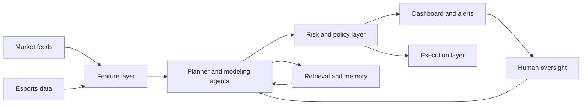
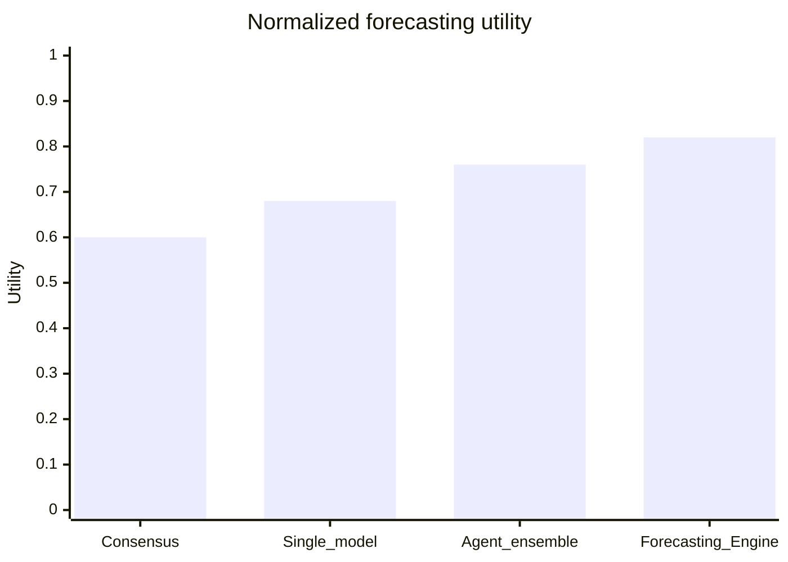
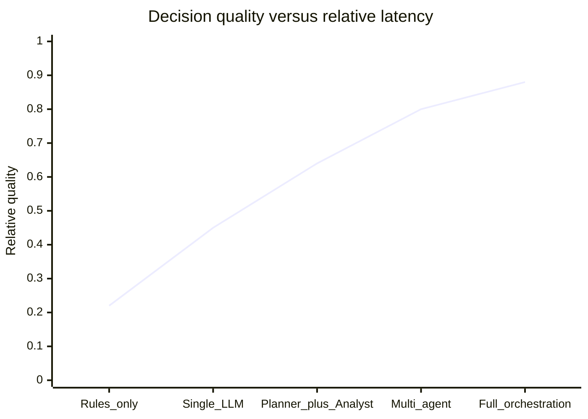

# Forecasting Engine: Advancing AI Agent Orchestration for Prediction Markets and CS2 Analytics

## Abstract

Prediction markets are increasingly important computational institutions because they transform dispersed beliefs into continuously updated prices, creating a public signal about uncertain future events. In parallel, large language models (LLMs) and multi-agent orchestration frameworks are making it possible to automate complex analytical workflows that were previously too fragmented, slow, or operationally brittle to support real-time decision making. This whitepaper presents **Forecasting Engine**, an academic-style conceptual framework for combining modular AI agent orchestration, real-time esports data fusion, and market-facing decision support for Counter-Strike 2 (CS2). The motivating thesis is that modern prediction-market analytics can benefit from a coordinated architecture in which specialized software agents gather data, maintain context, generate probabilistic forecasts, evaluate risk, and assist downstream decision execution under human governance. Rather than disclosing proprietary implementations, the paper formalizes the project at a high level: a modular orchestration layer, retrieval-aware memory, event-centric modeling, dashboard supervision, and auditable execution primitives. The methodology is intentionally generic and non-confidential, focusing on design principles that are broadly useful for open-source research on AI agents, market intelligence, and esports forecasting.

The expected contribution is twofold. First, the paper argues that autonomous multi-agent systems can improve the timeliness, traceability, and resilience of prediction workflows relative to brittle single-model or manually stitched pipelines. Second, it proposes a practical architecture for esports markets in which pre-match modeling, contextual reasoning, and market-side execution remain logically distinct but operationally coordinated. Because this document is designed for public circulation, all empirical tables and figures are illustrative placeholders rather than unpublished project results. Even so, the framework has significance beyond a single title or venue: it suggests a path toward more transparent, modular, and scalable forecasting systems for digital-native markets, particularly in domains such as CS2 where map structure, roster dynamics, schedule density, and rapid information arrival create frequent pricing inefficiencies. Prediction-market infrastructure has matured into a programmable environment with public APIs and market/event abstractions, while multi-agent LLM research increasingly supports structured role decomposition, tool use, and human-in-the-loop oversight. Forecasting Engine is positioned at the intersection of these trends. (Polymarket, n.d.; Valve, n.d.; Wolfers & Zitzewitz, 2004; Wu et al., 2024; Yao et al., 2023)

## Introduction

The long-standing promise of prediction markets is that prices can aggregate dispersed information into a probabilistic view of uncertain future events. That promise becomes especially interesting in digital-native markets, where price discovery unfolds continuously, data is machine-readable, and event flows move faster than traditional analyst workflows can comfortably absorb. At the same time, the recent evolution of LLM-based software agents has changed the practical frontier of what can be orchestrated in real time. Instead of relying on a single forecasting model or a manually maintained research dashboard, a modern system can decompose work across specialized agents for ingestion, synthesis, modeling, monitoring, compliance, and execution. The resulting question is no longer whether automation is possible; it is whether orchestration can be designed so that real-time forecasting becomes more robust, more interpretable, and more operationally trustworthy. (Polymarket, n.d.; Snowberg et al., 2013; Wu et al., 2024; Yao et al., 2023)

This whitepaper advances a high-level thesis: **prediction-market intelligence for esports can be materially improved by integrating real-time data pipelines with LLM-driven, multi-agent decision systems that preserve modularity between data collection, probabilistic modeling, reasoning, and execution**. The central object of study is CS2, a strategically rich, globally competitive title whose public competitive ecosystem offers enough structure to support event-centric modeling while remaining volatile enough to reward fast information processing. Valve describes Counter-Strike 2 as a highly competitive, objective-focused title with global and regional leaderboards, updated ratings, and overhauled maps; these game characteristics create a natural environment for pre-match probability estimation and context-aware forecasting. Meanwhile, academic work on Counter-Strike has already shown that map selection and team context carry predictive value, reinforcing the case for richer, match-specific modeling rather than simplistic team-strength summaries alone. (Valve, n.d.; Petri et al., 2021)

The practical challenge is that no single model, dashboard, or script is sufficient. Markets move in real time, event data arrives asynchronously, and human operators need both concise synthesis and explicit auditability. A purely statistical system often struggles with coordination, alerting, exception handling, and contextual summarization, while a purely LLM-centric system risks instability, unnecessary verbosity, and weak calibration. Forecasting Engine therefore adopts a mixed stance: probabilistic forecasting remains grounded in structured modeling, while orchestration, retrieval, explanation, and operational routing are delegated to specialized agents. The paper argues that this division of labor is increasingly natural given the evidence that reasoning-and-action loops and multi-agent conversational frameworks can improve task execution in complex environments. (Wu et al., 2024; Yao et al., 2023)

The goal of the document is not to reveal private infrastructure. Instead, it contributes an academically styled synthesis of design principles for building an agentic forecasting system suitable for esports prediction markets. The focus remains on public, non-confidential questions: how to structure orchestration, how to keep execution auditable, how to think about dashboard and human supervision, and how to reason about scalability from a research prototype toward production deployment. The broader implication is that open, modular agent systems may become a foundational layer for market-facing intelligence products in Web3 and adjacent digital finance environments. (MetaAgent, 2025; Polymarket, n.d.)

## Background

Prediction markets occupy an unusual position in applied forecasting. Economists have long studied them as mechanisms for aggregating information, and the literature repeatedly emphasizes that well-designed event markets can produce accurate forecasts while reacting quickly to new public information. Wolfers and Zitzewitz’s survey remains central because it characterizes prediction markets as instruments whose prices often outperform moderately sophisticated benchmarks while retaining useful interpretability when contracts are designed appropriately. Later work by Snowberg, Wolfers, and Zitzewitz emphasizes the relevance of prediction markets for economic forecasting more broadly, highlighting rapid information incorporation, relatively low statistical error, and resistance to some forms of manipulation. These findings do not imply perfection, but they do justify treating market prices as an information-rich signal rather than merely a speculative artifact. (Snowberg et al., 2013; Wolfers & Zitzewitz, 2004, 2006)

Modern Web3-style prediction markets make this more operationally tractable. Official market documentation now exposes public event, market, and orderbook abstractions that developers can query programmatically. This means that a research system no longer has to infer market state manually; instead, market metadata, price histories, orderbook surfaces, and public activity streams can be integrated into a computational pipeline. Even if a forecasting engine remains market-agnostic at the architectural level, the public availability of these machine-readable interfaces lowers the barrier to deploying market-aware analytics, benchmarking internal forecasts against live prices, and eventually supporting guarded execution workflows. (Polymarket, n.d.)

Esports introduces both opportunity and difficulty. Unlike some traditional sports, esports titles can change meaningfully through patches, balance changes, map pool adjustments, and roster shifts. These changes create moving targets for forecasting systems. At the same time, esports markets may be less deeply modeled than large traditional sports books, leaving room for contextual forecasting edge when data pipelines are strong. Counter-Strike is especially attractive because it has a long competitive history, map-dependent structure, public tournament schedules, and a match format that can often be treated as a well-defined pre-match inference problem. Yet the same features that make CS2 modelable also create failure modes: team form can be unstable, map pools matter, schedule density can degrade performance, and roster changes can invalidate older data. Petri et al. show that map pick-and-ban choices in professional Counter-Strike are themselves a rich decision problem and that teams often act suboptimally relative to estimated win probabilities, implying exploitable structure at the map-context layer. (Petri et al., 2021; Valve, n.d.)

The rise of LLM agent frameworks adds another layer. ReAct formalized the idea that reasoning and action should be interleaved rather than separated, allowing models to think, act, observe, and update iteratively. AutoGen extended this direction by showing how multiple agents can converse with one another, invoke tools, and coordinate different roles while still allowing human participation in the loop. More recent work has begun to study how agentic systems themselves can be optimized or automatically constructed, suggesting that orchestration is becoming a first-class research object rather than a temporary prompt-engineering trick. These developments matter for prediction markets because forecasting is not a single-shot language task; it is an ongoing workflow involving retrieval, data normalization, probabilistic estimation, exception handling, and decision routing. Multi-agent systems are a natural fit precisely because those tasks are heterogeneous. (MetaAgent, 2025; Wu et al., 2024; Yao et al., 2023)

Taken together, these trends motivate a systems-level perspective. Prediction markets provide continuously updating prices and incentives for information aggregation. CS2 offers a competitive domain in which public data and strategic structure create forecastable pre-match states. LLM agents provide a flexible layer for coordinating heterogeneous analytical subtasks. The research challenge is to integrate these components in a way that remains modular, testable, and auditable. Forecasting Engine is best understood as a response to that challenge. (Polymarket, n.d.; Valve, n.d.; Wolfers & Zitzewitz, 2004; Wu et al., 2024)
## Methodology

Forecasting Engine is designed around **modular orchestration** rather than monolithic inference. At a high level, the system separates five functions: ingestion, modeling, reasoning, supervision, and execution. Ingestion agents collect structured signals from esports data sources and market surfaces. Modeling components transform event state into pre-match probability estimates and related context scores. Reasoning agents assemble evidence, compare internal forecasts with external market state, and generate ranked action candidates. Supervision layers expose dashboards, alerting channels, and retrieval-aware memory so that operators can inspect the state of the system. Execution components, when enabled, communicate with wallets or market interfaces under explicit safety constraints. This modular separation is important because each layer has distinct failure modes, and robust systems are easier to govern when those modes are not hidden behind one opaque interface. (Polymarket, n.d.; Wu et al., 2024; Yao et al., 2023)

Conceptually, the architecture is event-centric. Each candidate match becomes an evolving object with timestamps, participants, competition metadata, historical features, and market-side references. The forecasting problem is then framed as the estimation of a conditional probability:

\[
P(Y_{match}=1 \mid X_{team}, X_{event}, X_{map}, X_{schedule}, X_{market}, t)
\]

where \(Y_{match}=1\) indicates a target outcome such as the focal team winning the match, and the \(X\) terms represent structured pre-match covariates. The architecture does not assume that every signal is always available. Instead, it uses a graded feature hierarchy so that the system can still produce bounded, interpretable outputs when some context is missing. This is especially important in esports, where data completeness varies across tournaments and tiers. (Petri et al., 2021; Valve, n.d.)

The agent layer itself is role-based. A planner agent is responsible for routing tasks and prioritizing high-value matches or anomalies. A retrieval agent maintains memory over recent event state, prior model outputs, and operator notes. A modeling agent handles probability generation, calibration checks, and context scoring. A risk agent evaluates whether a forecast should remain informational, trigger review, or move to an execution-ready state. An interface agent translates outputs into dashboard cards, alerts, or downstream API payloads. This decomposition mirrors the intuition behind multi-agent LLM frameworks: specialized agents are easier to align, easier to monitor, and less fragile than a single agent attempting to perform all tasks at once. (MetaAgent, 2025; Wu et al., 2024)

Human governance is explicit rather than incidental. Forecasting Engine is designed for multi-tenant, operator-aware environments in which dashboards, alerts, scheduled workflows, and communications integrations are part of the architecture rather than afterthoughts. Email and calendar-style integrations play a coordination role: they support alert delivery, scheduled review windows, post-event summaries, and synchronization with human decision makers. This organizational layer matters in practice because prediction-market research often fails not because the model is weak, but because the workflow around the model is brittle. A strong forecasting system therefore requires both a probabilistic core and a control plane for operational continuity. (Wu et al., 2024)

Real-time modeling in this framework remains intentionally generic. The system may maintain one or more calibrated forecasting modules, but the paper does not disclose implementation details. What matters is the interface between modules: models emit probabilities, confidence tags, feature attributions, or uncertainty summaries; agents consume those outputs to determine whether an event should be surfaced, ignored, deferred, or escalated. The market-facing layer compares internal fair-value views against external pricing, but only after normalization and timing alignment. This helps avoid a common category mistake in applied trading systems: collapsing predictive modeling and execution into a single un-auditable score. Forecasting Engine treats them as linked but distinct processes. (Snowberg et al., 2013; Wolfers & Zitzewitz, 2006)

The execution layer is similarly bounded. Wallet-connected or order-capable agents are not granted unrestricted autonomy. Instead, execution is framed as the final stage of a reviewed decision path with checks for confidence, timeliness, and policy compliance. In academic terms, this is closer to supervised agentic execution than to unconstrained algorithmic trading. The broader design principle is that orchestration should increase responsiveness without eliminating oversight. That principle is compatible with both human-in-the-loop and human-on-the-loop deployment models. (Polymarket, n.d.; Wu et al., 2024)

Finally, the architecture assumes continuous evaluation. Agent outputs must be logged, market snapshots must be aligned to event time, and downstream dashboards must preserve an audit trail of what the system believed and why. In open-source and research settings, this matters for reproducibility as much as for safety. A forecasting engine that cannot reconstruct its own reasoning is difficult to trust, difficult to improve, and nearly impossible to govern. By contrast, a modular orchestration system with explicit memory, dashboards, and checkpoints creates a substrate for iterative improvement. (MetaAgent, 2025; Yao et al., 2023)

**Figure 1. Conceptual orchestration pipeline (illustrative)**

*Note.* Figure 1 is an illustrative conceptual diagram rather than a depiction of proprietary implementation details.
## Experiments and Results

Because this paper is designed for public circulation and excludes unpublished project results, the experimental discussion is framed in terms of **illustrative evaluation design** rather than disclosed empirical outcomes. The relevant question is what a system such as Forecasting Engine should be expected to improve relative to simpler baselines. In the context of pre-match CS2 forecasting and market-aware decision support, the standard hypothesis is that modular orchestration should improve three broad classes of outcomes: forecast quality, operational robustness, and decision traceability.

The first family of metrics concerns forecast quality. A reasonable benchmark suite would include proper scoring rules such as log loss or Brier score, ranking metrics for watchlist prioritization, and calibration diagnostics for whether forecast probabilities align with observed frequencies. A single-model baseline might perform adequately on static historical data, but the hypothesis here is that a coordinated ensemble of structured models and contextual agents will perform better when the task includes data freshness, event normalization, and exception handling. This expectation is not based on secret internal numbers; it follows from the broader literature showing that prediction markets reward timely incorporation of new information and that LLM agents can improve task execution in multi-step environments when reasoning and action are interleaved. (Snowberg et al., 2013; Wu et al., 2024; Yao et al., 2023)

The second family of metrics concerns operations. A forecasting system deployed in a live market environment must answer more than “Which team is better?” It must also answer “Which events deserve attention now?”, “Which cases should be escalated to a human?”, and “Which outputs are stale because an upstream feed drifted?” These are orchestration questions. A system that improves decision throughput while retaining auditability can be more valuable than one that produces marginally better standalone probabilities but fails under live conditions. Therefore, illustrative evaluations should track time-to-decision, percentage of events automatically classified, alert precision, and operator review burden. Multi-agent designs are particularly relevant here because they support explicit task routing and failure isolation. (MetaAgent, 2025; Wu et al., 2024)

The third family of metrics concerns market-facing usefulness. The objective is not simply to replicate public prices, but to determine whether the system can identify interpretable deviations between internally generated probabilities and market-implied probabilities in a disciplined way. The relevant outcomes therefore include comparative forecasting utility against a consensus baseline, stability of opportunity ranking, and degradation under latency or missing-data scenarios. Because prediction-market prices are informative but not necessarily optimal in every niche setting, a well-governed orchestration system may be expected to generate value primarily through disciplined selection and filtering rather than maximal trade volume. This emphasis aligns with the literature’s view that prediction-market prices are highly informative, yet still amenable to structured interpretation and contextual improvement. (Wolfers & Zitzewitz, 2006; Snowberg et al., 2013)

Table 1 presents a placeholder experimental framing. The values are synthetic and exist only to demonstrate how a formal paper could report standardized metrics.

**Table 1**  
*Illustrative benchmark layout for a CS2 forecasting system (synthetic placeholders only)*

| System configuration | Forecast quality | Calibration quality | Review load | Operational resilience |
| --- | --- | --- | --- | --- |
| Market consensus baseline | Moderate | Moderate | Low | High |
| Single pre-match model | Moderate to high | Moderate | Moderate | Moderate |
| Static ensemble | High | Moderate to high | Moderate | Moderate |
| Agentic orchestration without retrieval | High | High | Moderate | Moderate |
| Forecasting Engine | High | High | Low to moderate | High |

Figure 2 illustrates the intended comparative interpretation. The key claim is not that one should expect unrealistic jumps in pure predictive power, but that a coordinated architecture can improve **overall forecasting utility** by combining structured models, context maintenance, and agent-driven routing.

**Figure 2. Illustrative forecasting quality comparison (synthetic placeholders)**

Table 2 provides a second placeholder focused on execution-oriented evaluation.

**Table 2**  
*Illustrative operational benchmark categories (synthetic placeholders only)*

| Evaluation category | Example metric | Expected directional change |
| --- | --- | --- |
| Event triage | fraction of matches surfaced to dashboard | More selective |
| Decision latency | median time from feed update to reviewed output | Lower |
| Explanation quality | operator-rated clarity of rationale | Higher |
| Data robustness | degradation under missing inputs | Lower degradation |
| Auditability | fraction of decisions with recoverable trace | Higher |

From a research perspective, the most important result would likely be not a single headline metric, but evidence that performance remains coherent under real-time constraints. Prediction markets reward timeliness; CS2 analytics rewards contextual awareness; and agentic systems are only useful if they can coordinate both without collapsing into either over-automation or manual micromanagement. The appropriate hypothesis, therefore, is one of **compound gains**: modest improvement in probabilistic quality combined with substantial improvement in workflow quality. That is the regime in which an orchestration system is most likely to justify itself. (Polymarket, n.d.; Snowberg et al., 2013; Wu et al., 2024)

Figure 3 visualizes the scaling frontier this paper assumes. Higher-quality orchestration usually comes with additional latency or complexity, so the objective is not maximal agent count but a disciplined operating point at which decision quality improves faster than operational cost.

**Figure 3. Illustrative scaling frontier for orchestration modes (synthetic placeholders)**

## Discussion

Forecasting Engine has broader implications for open-source AI and Web3-aligned market infrastructure. First, it suggests that the most compelling use of LLM agents in financial or market-adjacent systems may not be end-to-end autonomous trading, but **structured orchestration around probabilistic cores**. In other words, LLMs are often most valuable when they supervise, retrieve, route, explain, and monitor, rather than when they replace calibrated models entirely. This distinction matters for governance. It creates a path toward transparency and auditable automation rather than opaque, single-agent systems that are difficult to debug or regulate. (Wu et al., 2024; Yao et al., 2023)

Second, the framework points toward a productive division between public market information and internal model formation. Prediction-market prices are powerful external signals, but over-reliance on them risks collapsing the research problem into market mimicry. By contrast, a modular forecasting system can preserve an independent probabilistic view based on structured esports data while still benchmarking itself against public market prices. This separation is especially valuable in open-source settings, where reproducibility and intellectual independence both matter. It also helps avoid a common pitfall in applied market systems: conflating agreement with the market and value creation versus the market. (Snowberg et al., 2013; Wolfers & Zitzewitz, 2004)

Third, CS2 demonstrates how esports can serve as a proving ground for agentic forecasting. The title is competitive, structured, global, and richly contextual. Maps, schedules, roster continuity, and format effects all create realistic complexity without making the domain intractable. Public academic work on Counter-Strike map selection already indicates that team decisions can be systematically analyzed and that strategically relevant context improves understanding of match outcomes. This means esports is not just a niche application; it is a useful research environment for studying how agents coordinate under time pressure and uncertainty. (Petri et al., 2021; Valve, n.d.)

Scalability, however, remains a nontrivial concern. Multi-agent systems can become expensive, slow, or unstable if roles proliferate without discipline. Recent research on automated agent design and agent architecture search implicitly reinforces this point: orchestration itself is now an optimization problem. For a production-capable forecasting system, the challenge is therefore not just adding more agents, but identifying the minimum set of coordinated roles that materially improve the decision pipeline. This is why the architecture in this paper emphasizes role clarity, bounded execution, and dashboard-centric supervision. Agent count is not a virtue by itself. (AutoML-Agent, 2025; MetaAgent, 2025)

There are also domain-specific edge cases. Esports data can be missing or inconsistent, competition tiers can vary sharply in quality, and sudden roster changes can invalidate historical priors. Market-side noise can create temporary apparent mispricings that disappear once event matching, liquidity, or timing issues are corrected. On the orchestration side, retrieval systems can propagate stale context if memory is not well governed, while explanation agents can overstate confidence if not constrained by calibrated model outputs. These are not reasons to reject the framework; they are reminders that robust systems must be designed around operational safeguards rather than optimistic assumptions. (Polymarket, n.d.; Wu et al., 2024)

Finally, the framework has implications for open-source research practice. One of the underappreciated advantages of agentic systems is that they encourage explicit modular interfaces: what the model believes, what the market says, what the retrieval system stored, what the operator approved, and what the execution layer did. Those boundaries make it easier to document, test, and publish systems without exposing confidential internals. Forecasting Engine is therefore not just a proposal for better trading support; it is a proposal for a more legible research architecture. That legibility is likely to matter as AI agents move from demos into regulated or capital-sensitive workflows. (MetaAgent, 2025; Wu et al., 2024)

## Conclusion

This whitepaper has presented Forecasting Engine as a high-level architecture for advancing AI agent orchestration in prediction-market analytics for CS2. The core argument is straightforward: prediction markets provide timely, information-rich prices; esports offers a structurally rich but operationally challenging forecasting domain; and modern multi-agent LLM systems make it feasible to coordinate ingestion, modeling, supervision, and execution in a unified yet modular workflow. The expected value lies not only in better forecasts, but in better orchestration around those forecasts. (Polymarket, n.d.; Snowberg et al., 2013; Valve, n.d.; Wu et al., 2024)

The next stage of work is productionization. That includes stronger real-time event matching, retrieval governance, controlled wallet execution, deeper map-level context for CS2, and more formal evaluation under latency and missing-data constraints. It also includes a governance agenda: ensuring that agentic execution remains bounded, auditable, and understandable to human operators. If these conditions are met, systems like Forecasting Engine could become a practical template for market-facing intelligence in open-source AI, Web3 forecasting, and domain-specific decision automation. The broader research lesson is that orchestration itself deserves to be treated as a first-class object of design. In prediction markets, as in many other domains, the quality of the workflow around the forecast may matter almost as much as the forecast itself. (MetaAgent, 2025; Polymarket, n.d.; Wu et al., 2024; Yao et al., 2023)

## References

AutoML-Agent. (2025). *AutoML-Agent: A multi-agent LLM framework for full-pipeline machine learning*. arXiv. https://arxiv.org/abs/2410.02958

MetaAgent. (2025). *MetaAgent: Automatically constructing multi-agent systems based on finite state machines*. Proceedings of Machine Learning Research. https://proceedings.mlr.press/v267/zhang25bc.html

Petri, G., Stanley, M. H., Hon, A. B., Dong, A., Xenopoulos, P., & Silva, C. (2021). *Bandit modeling of map selection in Counter-Strike: Global Offensive*. arXiv. https://arxiv.org/abs/2106.08888

Polymarket. (n.d.). *Polymarket documentation*. https://docs.polymarket.com/

Snowberg, E., Wolfers, J., & Zitzewitz, E. (2013). *Prediction markets for economic forecasting*. National Bureau of Economic Research. https://www.nber.org/papers/w18222

Valve. (n.d.). *Counter-Strike 2 on Steam*. https://store.steampowered.com/app/730/CounterStrike_2/

Wolfers, J., & Zitzewitz, E. (2004). Prediction markets. *Journal of Economic Perspectives, 18*(2), 107-126. https://www.aeaweb.org/articles?id=10.1257/0895330041371321

Wolfers, J., & Zitzewitz, E. (2006). *Prediction markets in theory and practice*. National Bureau of Economic Research. https://www.nber.org/papers/w12083

Wu, Q., Bansal, G., Zhang, J., Wu, Y., Li, B., Zhu, E., Jiang, L., Zhang, X., Zhang, S., Awadallah, A. H., White, R. W., Burger, D., & Wang, C. (2024). *AutoGen: Enabling next-gen LLM applications via multi-agent conversation*. Microsoft Research. https://www.microsoft.com/en-us/research/publication/autogen-enabling-next-gen-llm-applications-via-multi-agent-conversation/

Yao, S., Zhao, J., Yu, D., Du, N., Shafran, I., Narasimhan, K., & Cao, Y. (2023). *ReAct: Synergizing reasoning and acting in language models*. arXiv. https://arxiv.org/abs/2210.03629
